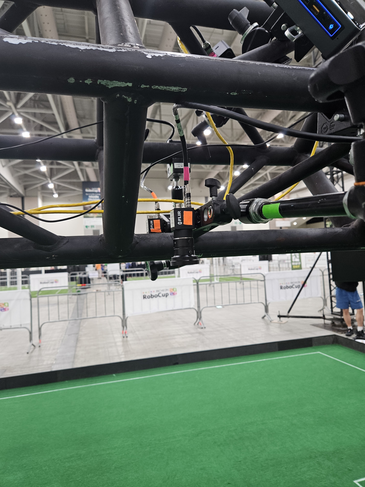
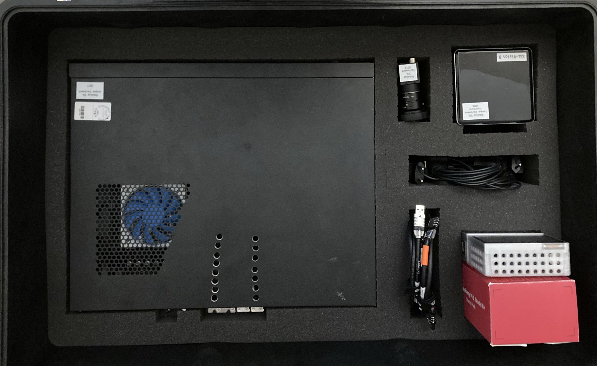
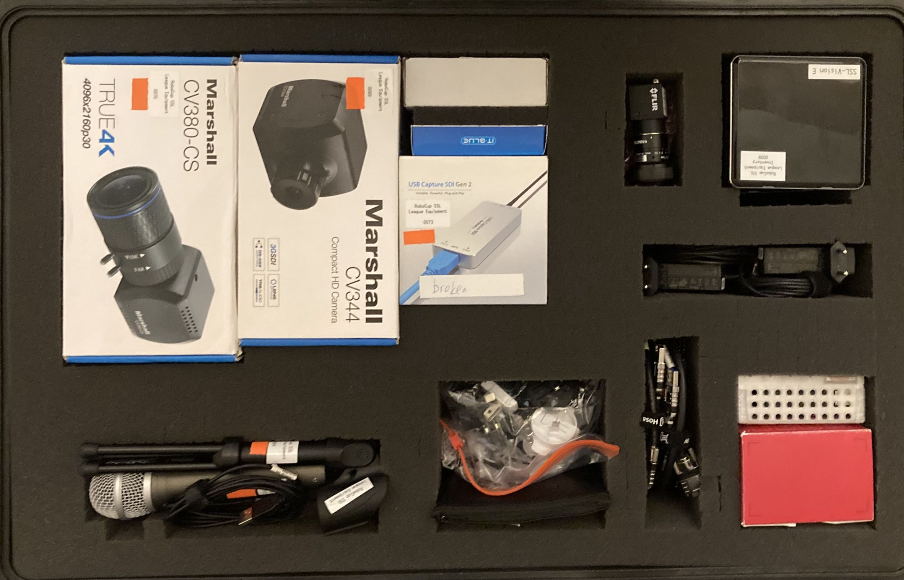
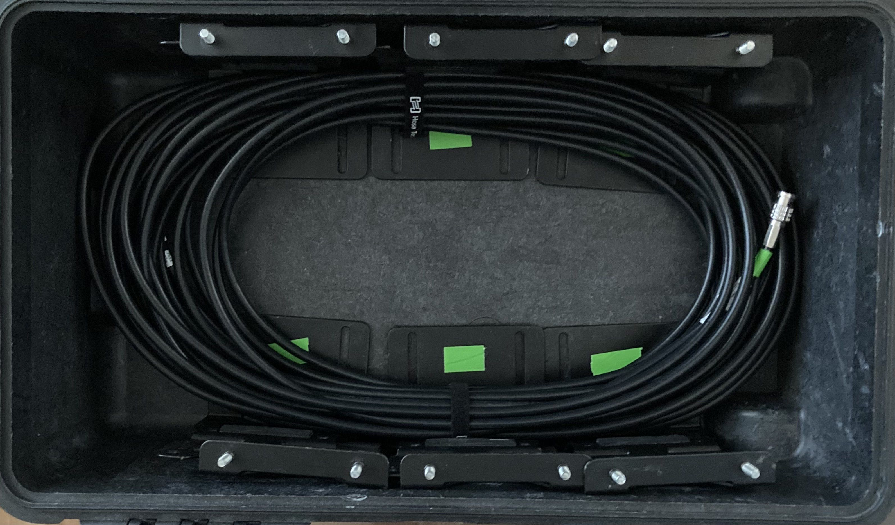
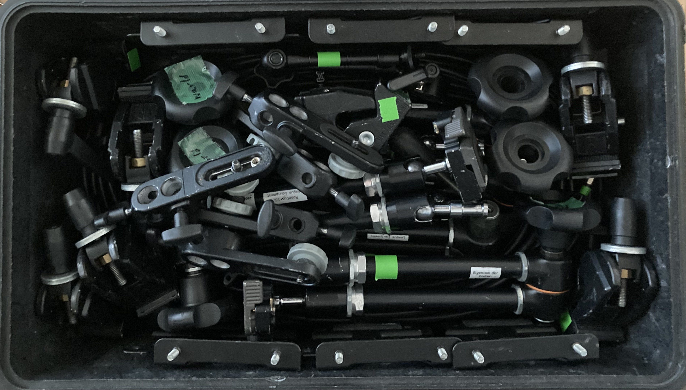
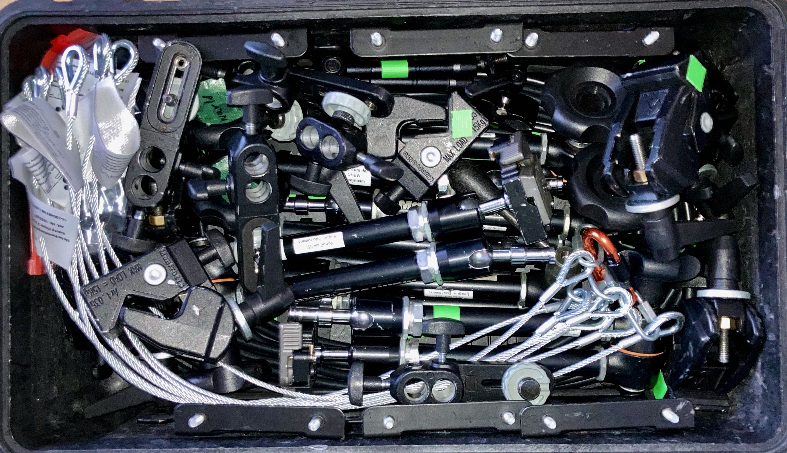

# Pelican/Travel Case Packing

The SSL owns 4 hard-shell travel cases, colloquically called "Pelicans", that are re-used for each global event as well 
as some of the regionals. They typically go home with a reliable team or TC/OC member for transport to the next 
regional/global event. This page documents their contents and the system they use to ensure event setup and teardown is 
easy.

## Top Level Description

The cases mostly carry the cameras, lenses, truss computers, and cabling required to setup field vision systems and
streaming.

The league currently has 8 field camera systems (camera + lens + nuc + accessories) which can support 4 Division A 
fields or 8 Division B fields. We use 5 total systems at most international events (1 Div A, 2 Div B, 1 Div B practice)
which leaves 3 spare systems. This gives us spares and the ability to run any one field redundantly if we need to test
different vision versions or configurations concurrently.

The cases are externally labeled as follows:
 - Case 1: Equipment SSL Set 1
 - Case 2: Equipment SSL Set 2
 - Case 3: Cables SSL Set 2 (roughly 21.6kg)
 - Case 4: Cables SSL Set 1 (roughly 21.5kg)

[Laminated Packing Inserts](https://docs.google.com/document/d/1DBrpu4QNOSp4uC7DHPw7sSZ3TgjXhoRiypexUmNRG-8/edit?usp=sharing).

## Organizational System

The league currently owns 4 pelicans, two large, two small. They are each colored, which is the first key
aspect of how they are organized. The big pelicans are pink and orange and have a big piece of colored gaff tape on the
side. The small pelicans are green and blue and also have a piece of gaff tape on the side. Some ancillary streaming
equipment is brought by TIGERs Mannheim and this case is labeled yellow.

**Every case, camera, computer, and cable that is league owned is labeled with colored tape.** Every items always comes
from and goes back into the case of the corresponding color.

If you are helping with teardown, you can always move an unknown item next to the case of the corresponding color, even 
if you don't know where it goes yet. Likewise, if you are following pictures in a setup guide or someone asks for an
items "from the pink case" you'll know what they mean when they make that request.

Every case should have a laminated sheet fully enumerating the items in the case and including picture of how the
case is to be packed at every layer. The cases are very full, so it's essential that you pack the case the way the
pictures describe. These sheets can also help you located a needed piece of equipment.

[Laminated Packing Inserts](https://docs.google.com/document/d/1DBrpu4QNOSp4uC7DHPw7sSZ3TgjXhoRiypexUmNRG-8/edit?usp=sharing).

## Example Camera Setup

Here's an example of two cameras in a redundant configuration on a Division A truss (one field half) in Incheon 2026.
Note the colored tape on the cameras, cables, and mounting arms. That all corresponds to the above mentioned cases. In
this picture, camera mount arms are from the green pelican, the cameras are from the orange, and one USB3 cable is from
the pink pelican.

## Photos from Packing Lists

You'll notice the following photos (taken from the laminated packing sheets) shows layer by layer color coordinated
packing as described.

### Case 2

Here's an example of packing Case 2, a large pelican with camera compute and streaming cameras and lenses. All of this
guidance should also be included in the laminated packing insert.

Layer 1

Layer 2

### Case 3

Here's an example of packing Case 3, a small pelican with cables and mounting hardware. All of this guidance should be
included in the laminated packing insert.

Layer 1

Layer 2

Layer 3

