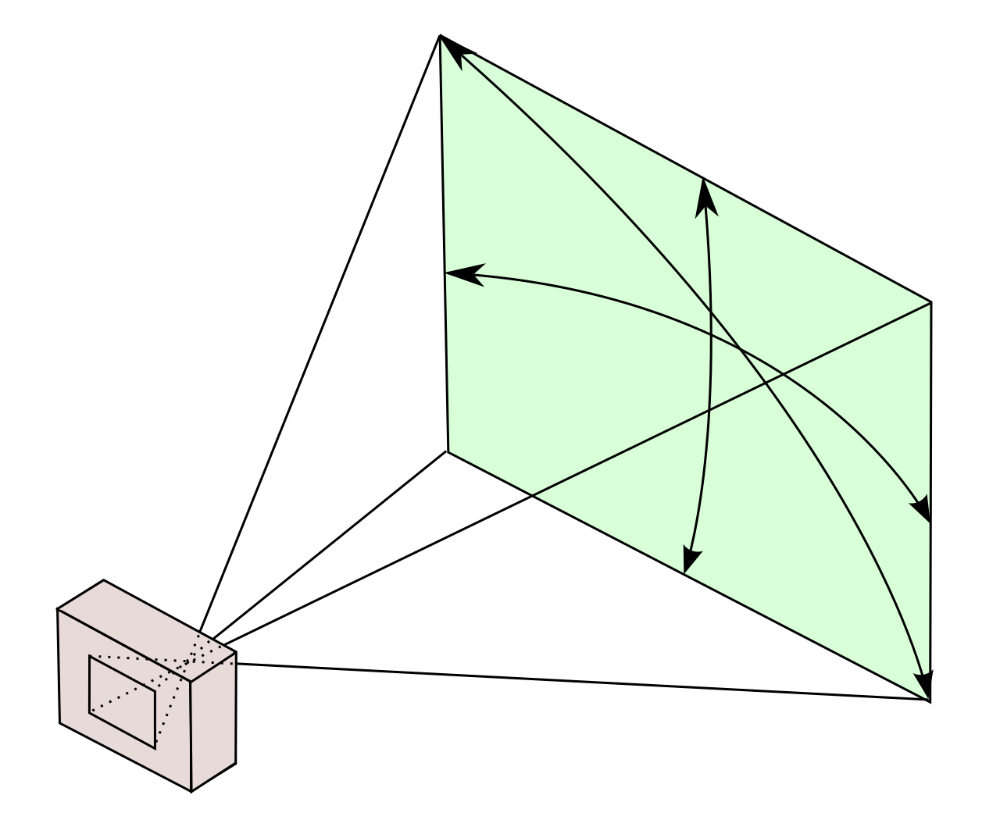
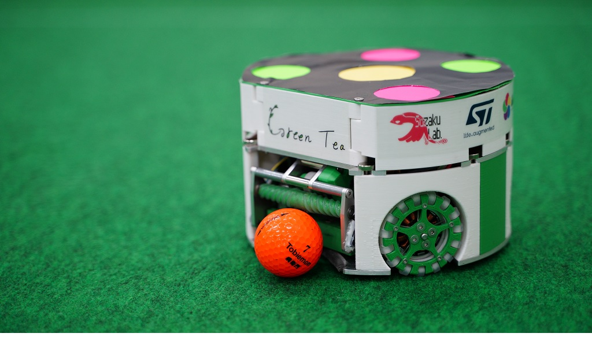
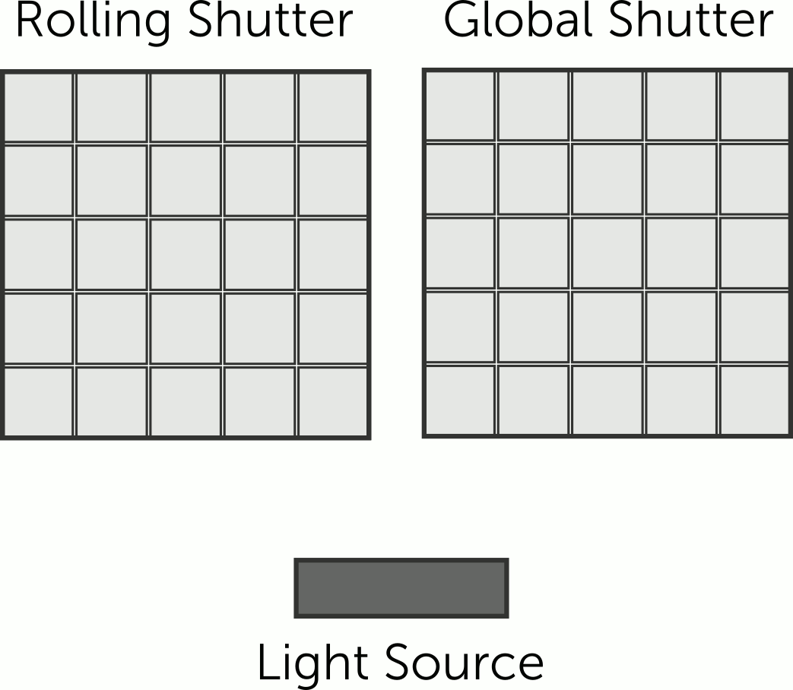

# Cameras and Lenses

Picking cameras (and lenses) is one of the most asked questions by teams new and old alike. Often by the time a camera
upgrade is needed the team member who specd and built the original field is long gone. This page is intended to cover
the factors in choosing the number of cameras, parameters, vendors, and other complex and commonly asked about items.

If you already know what you're doing and just want to check on configuration, see the
[camera calculator](camera-calculator.md).

## Prerequisites

Before choosing a camera you must have committed to a lab or event space. Ceiling height will determining factor.

You should also have an idea of the field size. Are you doing a small patch in your lab for testing or are you hosting
an event with a regulation field. Either way, you need to know the size. This combined with ceiling height will
determine the number of cameras needed.

## Major Factors

First, we'll cover the major factor before doing an example calculation. This section covers the "why", not the "how".
Jump ahead if you'd like.

### Pixel Density

[Pixel density](https://en.wikipedia.org/wiki/Pixel_density) describes the number of pixels in a unit area, typically
pixels per inch (PPI) or pixels per cm (PPCM). This matters because interpreting the robot jersey requires enough pixels
covering its features; without enough, the robot's position cannot be recovered. Cameras have a
[field of view](https://en.wikipedia.org/wiki/Field_of_view), a cone that expands outward from the camera sensor. The
lens determines the properties of this cone, the same way your eyes resolve close objects in more detail than distant
ones. Because the camera's height above the field is fixed, knowing the height and the cone's properties is enough to
compute pixel density, or to solve for any other unknown in that relationship.

| Field of View                                   | Robot Jersey                                                |
| ----------------------------------------------- | ----------------------------------------------------------- |
|  |  |

The left image shows a camera's field of view; the right shows an SSL robot's jersey (GreenTea 2021). If camera
resolution is too low to distinguish the yellow, pink, and green dots, the robot's position cannot be recovered. In the
left image, the green box grows larger the farther it sits from the camera. Since the sensor has a fixed number of
pixels, and that same pixel count spreads across a larger area farther from the camera, pixel density decreases with
distance. Eventually density drops below the size of a single dot, and position can no longer be recovered. The final
camera configuration must provide enough pixels to resolve each dot and the ball.

### Field of View

Field of view (FoV) refers to the properties of the cone or pyramid expanding from the image sensor, described above. It
is almost always given as either a single angle for a cone, or a horizontal and vertical angle for a pyramid. Because
FoV determines how much pixel density is lost per unit distance from the sensor, it is a key camera parameter: a wider
FoV loses more pixel density per unit distance but sees more of its surroundings. This is a geometry tradeoff — a low
ceiling calls for a wider FoV, since a narrow cone or pyramid under a low ceiling will not reach the outer parts of the
field. No single FoV is inherently good or bad; it is a tradeoff against mounting height and cost. Cheaper webcams
typically have an integrated lens with a fixed, wide FoV, which may not suit every space. High-end cameras separate the
camera body and lens, giving full control over FoV, at greater expense.

### Shutter Type

In this context, "shutter type" refers to a virtual shutter; physical shutters are not present on the cameras we buy.
The two major types are rolling and global. A rolling shutter converts one row of pixels at a time, whereas a global
shutter converts the whole image at once. A rolling shutter is cheaper, but when objects move quickly, different parts
of the object are converted at different times, an artifact sometimes called the jello effect. A global shutter avoids
this, at substantial cost and engineering complexity in the image sensor. **Global shutters are universally preferred
for robotics and computer vision tasks, but many teams do not buy them for their lab due to cost (sometimes 5-10x
cost).** The league's competition cameras are global shutter. **Anyone hosting an event should try to acquire global
shutter cameras.**

The tradeoff is robot speed. The jello effect worsens as an object moves faster. On a small lab test patch, where robot
speed is limited by field size, global shutters offer no real benefit. On a regulation field with more open space,
robots reach much higher speeds, and global shutter cameras become necessary. The exact magnitude of the jello effect
depends on several environmentally dependent settings, including exposure, so it is not possible to state a reliable
threshold like "global shutter is needed above robot speed X".

Teledyne-FLIR, our competition camera provider, has a
[detailed write-up of this effect](https://www.teledynevisionsolutions.com/learn/learning-center/imaging-fundamentals/rolling-vs-global-shutter/),
including the animation below.



Sony makes the global shutter image sensors that Teledyne-FLIR integrates. Their real-world example below shows the
difference between the shutter types in the curving of the helicopter rotor blades.

```{youtube} YmEH8z1JWgc
```

### Frame Rate

**Recommend >=60fps.** The competitions typically run 72fps, but this isn't guaranteed.

### Software Support by League Vision Software

The last key factor in purchasing a camera is software support. Most USB webcams use a standard protocol, supported via
[Video4Linux](https://en.wikipedia.org/wiki/Video4Linux) (v4l); the league vision tools integrate with v4l drivers
natively, so no development is needed for support. Ensure your camera's controls, such as white balance and exposure,
can be set from Linux and commanded not to auto-calibrate. Auto-calibration at the camera level is likely to break the
league software's color calibration, which expects those settings to remain constant after initial setup.

Global shutter and other high-end machine vision cameras typically do not support standard USB drivers, since they do
not operate as standard USB devices; the vendor instead supplies a custom API that must be used. For the league cameras,
Teledyne-FLIR provides the
[Spinnaker SDK](https://www.teledynevisionsolutions.com/products/spinnaker-sdk/?model=Spinnaker%20SDK&vertical=machine%20vision&segment=iis)
for their USB3 and GigE cameras. The league software already supports this API, though sometimes small tweaks are needed
for a given camera model. Picking a high-end machine vision camera not supported by the Spinnaker SDK will probably
require writing your own driver interface code for the league software. This is possible, but not a trivial task.

## Calculating Major Factors for Your Lab

This section turns [Pixel Density](#pixel-density) and [Field of View](#field-of-view) above into a repeatable
calculation. Given a camera, lens, and mounting height, it tells you whether that combination resolves the robot
markers, and if not, what to change.

### Inputs

You need six numbers:

- (h) — mounting height above the field surface (m)
- (f) — lens focal length (mm)
- $s_h, s_v$ — sensor width and height (mm), from the sensor datasheet
- $R_h, R_v$ — sensor resolution (pixels), horizontal and vertical
- (d) — diameter of the smallest feature you need to resolve (the robot ID/team marker dots)

If your lens/camera is specified directly as a field of view angle instead of focal length + sensor size, skip to step
2\.

### Step 1: Focal Length and Sensor Size to Field of View

A rectilinear lens's field of view is:

$$
\mathrm{FoV}_h = 2 \arctan\left(\frac{s_h}{2f}\right) \qquad
\mathrm{FoV}_v = 2 \arctan\left(\frac{s_v}{2f}\right)
$$

### Step 2: Field of View to Ground Coverage

For a camera mounted at height (h), looking straight down (nadir) at a flat field, the width and height of the ground
area it covers are:

$$
W = 2 h \tan\left(\frac{\mathrm{FoV}_h}{2}\right) \qquad
H = 2 h \tan\left(\frac{\mathrm{FoV}_v}{2}\right)
$$

This is an approximation: it assumes the camera points straight down and ignores lens distortion. It's accurate enough
to plan a purchase; the league software's calibration step corrects the remaining error at setup time.

### Step 3: Ground Coverage to Pixel Density

Pixel density is resolution divided by the ground distance it's spread across:

$$
\rho_h = \frac{R_h}{W} \qquad \rho_v = \frac{R_v}{H}
$$

Use $\rho = \min(\rho_h, \rho_v)$ as your working density — whichever dimension is tighter is what limits you.

### Step 4: Check Against the Marker Size

You need enough pixels across a marker dot to reliably find its center and classify its color, not just detect that
something is there. This page uses a minimum of 6 pixels across the diameter (d) — enough margin for motion blur and
rolling shutter that you don't also need to budget for those separately. The required density is:

$$
\rho_{\text{required}} = \frac{N_{\text{min}}}{d}
$$

The configuration works if $\rho \geq \rho_{\text{required}}$. If it doesn't, you have four options, in order of
usually-cheapest-first:

- Lower the mounting height (h) (shrinks coverage, raises density; may not be possible if the ceiling is fixed)
- Use a longer focal length (f) (narrows FoV, raises density; also shrinks coverage — you may need more cameras to cover
  the same field)
- Use a higher-resolution sensor (raises $R_h, R_v$ directly; no coverage tradeoff, but costs more)
- Split coverage across more cameras, each covering a smaller tile of the field at higher density (see
  [Known Good Configurations](#known-good-configurations) for how the league does this at competition height)

### Step 5: Field Coverage

If a configuration needs $N$ cameras to cover a field of area $A_{\text{field}}$, a quick sanity check is the total
footprint budget relative to the field:

$$
\text{Coverage Margin} = \frac{N \times W \times H}{A_{\text{field}}}
$$

A margin at or below 100% means the cameras' combined footprint can't even cover the field once, let alone overlap — it
will not work regardless of how they're arranged. A margin comfortably above 100% (the excess is overlap budget, spent
on stitching adjacent frames together and tolerating calibration/mounting error) is necessary, but not sufficient by
itself — it doesn't check that the footprints can actually be arranged to eliminate gaps, only that there's enough total
area to make that arrangement possible.

### Interactive Calculator

Plug in numbers instead of doing the arithmetic in [Steps 1-5](#calculating-major-factors-for-your-lab) by hand, using
the [Camera Field of View Calculator](camera-calculator.md).

## Known Good Configurations

Below are some examples of camera configurations that meet the pixel density and software compatibility requirements.
Each configuration below is actively used by at least one team or event. Additional known good configurations are
welcome. Please include any known limitations if you make a pull request.

### League Cameras and Lenses (Division A and Division B)

Worked example using a common league camera and one of two compatible 5mm lenses.

**Camera:**
[FLIR Blackfly S BFS-U3-51S5C-C](https://www.edmundoptics.com/p/bfs-u3-51s5c-c-usb3-blackfly-reg-s-color-camera/37240/)
— 2/3" sensor, $s_h = 8.45\ \text{mm}$, $s_v = 7.07\ \text{mm}$, $R_h = 2448\ \text{px}$, $R_v = 2048\ \text{px}$ (3.45
µm pixels).

**Lens:** either of Navitar's two 5 mm, 2/3"-format C-mount lenses (`1-19552` or `NMV-5M23`). They differ in aperture
range, not focal length or target sensor format, so $\mathrm{FoV}$ is the same either way for planning purposes:
$f = 5\ \text{mm}$.

**Mounting height:** $h = 6000\ \text{mm}$, within the [6.0-6.25 m official range](complayout.md#cameras).

**Marker size:** per the [SSL Rules vision pattern](https://ssl.robocup.org/rules/), the center (team) dot is Ø50 mm and
the four ID dots are Ø40 mm. The ID dots are the smaller, limiting feature: $d = 40\ \text{mm}$.

Using the [general method](#calculating-major-factors-for-your-lab):

$$
\mathrm{FoV}_h = 2 \arctan\left(\frac{8.45}{2 \times 5}\right) \approx 80.4°
\qquad
\mathrm{FoV}_v = 2 \arctan\left(\frac{7.07}{2 \times 5}\right) \approx 70.5°
$$

$$
W = 2(6000) \tan(40.2°) \approx 10{,}140\ \text{mm}
\qquad
H = 2(6000) \tan(35.3°) \approx 8{,}484\ \text{mm}
$$

$$
\rho_h = \frac{2448}{10{,}140} \approx 0.241\ \text{px/mm}
\qquad
\rho_v = \frac{2048}{8{,}484} \approx 0.241\ \text{px/mm}
$$

At $\rho \approx 0.241\ \text{px/mm}$, the 40 mm ID dots resolve to about $0.241 \times 40 \approx 9.7$ pixels across,
and the 50 mm center dot to about 12 pixels across — both above the 6 px minimum from
[Step 4](#step-4-check-against-the-marker-size). **This configuration passes**, with roughly 1.6-2x margin over the
minimum threshold.

**Field coverage** ([Step 5](#step-5-field-coverage)): this configuration's single-camera footprint is
$W \times H \approx 10.14 \times 8.48\ \text{m} \approx 86.0\ \text{m}^2$. Per the
[SSL Rules field dimensions](https://ssl.robocup.org/rules/), Division A's field of play is
$13.4 \times 10.4\ \text{m} = 139.4\ \text{m}^2$ and Division B's is $10.4 \times 7.4\ \text{m} = 77.0\ \text{m}^2$:

| Division | Cameras ($N$) | Total Footprint | Field Area | Coverage Margin |
| -------- | ------------- | --------------- | ---------- | --------------- |
| A        | 2             | 172.1 m²        | 139.4 m²   | 123%            |
| B        | 1             | 86.0 m²         | 77.0 m²    | 112%            |

Both divisions clear 100% with a positive overlap budget, consistent with these being real, working configurations —
Division B's margin is noticeably tighter, leaving less room for stitching/calibration error with only one camera.

### Japan Open Cameras and Lenses (Division A)

Same camera as [League Cameras and Lenses](#league-cameras-and-lenses-division-a-and-division-b)
([FLIR Blackfly S BFS-U3-51S5C-C](https://www.edmundoptics.com/p/bfs-u3-51s5c-c-usb3-blackfly-reg-s-color-camera/37240/)),
paired with a different 5 mm lens vendor: [Kowa LM5JC1M / LM5JCM](https://www.kowavision.com/products/lm5jc1m-lm5jcm) —
2/3" max sensor format, F2.8-16, 0.5% TV distortion.

Since the focal length ($f = 5\ \text{mm}$) and sensor are identical to the League configuration, the
[FoV, ground coverage, and pixel density](#league-cameras-and-lenses-division-a-and-division-b) work out the same:
$\rho \approx
0.241\ \text{px/mm}$, about 9.7 px across the 40 mm ID dots. The lenses differ in aperture range and mechanical build,
not focal length or target format, so this doesn't change the optics.

**Field coverage:** Division A uses 2 cameras, same as League — coverage margin 123% (see
[Step 5](#step-5-field-coverage)). Division B count for this configuration is not yet documented here.

### Peachtree Open Cameras and Lenses (Division B)

Four cameras cover Division B at Peachtree Open, split evenly into quadrants: two brought by RoboJackets, two by The
A-Team. Both teams use the same camera but different lenses, since each team's home lab ceiling differs.

**Camera (both teams):**
[FLIR Blackfly BFLY-PGE-13E4C-CS](https://www.edmundoptics.com/p/bfly-pge-13e4c-cs-118-blackflyreg-poe-gige-color-camera-d7aa6dab/30322/)
— 1/1.8" sensor, $s_h = 6.78\ \text{mm}$, $s_v = 5.43\ \text{mm}$, $R_h = 1280\ \text{px}$, $R_v = 1024\ \text{px}$ (5.3
µm pixels).

Both lenses are **varifocal** (adjustable focal length, unmarked dial) rather than fixed, so there's no single focal
length to plug into the method — instead, this solves the [general method](#calculating-major-factors-for-your-lab) in
reverse: given the lens's widest available zoom setting, what's the minimum mounting height needed to cover a full
quadrant with no gap?

#### At Peachtree Open

Cameras mount on arms with adjustable height, 10-12 ft ($3048$-$3658\ \text{mm}$) — this is the actual competition
mounting range, independent of either team's home lab ceiling.

**Target coverage:** a quadrant of Division B's $10.4 \times 7.4\ \text{m}$ field of play, split evenly:
$\text{target}_W = 5200\ \text{mm}$, $\text{target}_H = 3700\ \text{mm}$.

Rearranging [Step 2](#step-2-field-of-view-to-ground-coverage) ($W = h s_h / f$) for the minimum height that satisfies
both axes at a given focal length (f):

$$
h_{\text{required}} = \max\left(\frac{\text{target}_W \cdot f}{s_h},\ \frac{\text{target}_H \cdot f}{s_v}\right)
$$

**RoboJackets** —
[Computar E3Z4518CS-MPIR](https://www.bhphotovideo.com/c/product/1091754-REG/computar_e3z4518cs_mpir_1_2_4_5_13_2mm_f1_8_dn.html),
4.5-13.2mm, F1.8. At the widest end ($f = 4.5\ \text{mm}$):

$$
h_{\text{required}} = \max\left(\frac{5200 \times 4.5}{6.78},\ \frac{3700 \times 4.5}{5.43}\right)
= \max(3451,\ 3066)\ \text{mm} \approx 3.45\ \text{m}
$$

This sits near the top of the 3.05-3.66 m arm range — consistent with RoboJackets' cameras running high on the arm
(reachable by ladder, so not an installation problem).

**The A-Team** —
[Computar E3Z3915CS-MPWIR](https://www.bhphotovideo.com/c/product/1524951-REG/computar_e3z3915cs_mpwir_4k_1_1_8_3_9_10mm_f1_5.html),
3.9-10mm, F1.5. At the widest end ($f = 3.9\ \text{mm}$):

$$
h_{\text{required}} = \max\left(\frac{5200 \times 3.9}{6.78},\ \frac{3700 \times 3.9}{5.43}\right)
= \max(2991,\ 2657)\ \text{mm} \approx 2.99\ \text{m}
$$

This clears even the arm's minimum height (3.05 m), so The A-Team's cameras don't need to run high — any arm position
works.

Using RoboJackets near the top of the range (12 ft) and The A-Team near the bottom (10 ft) as representative positions,
the aggregate [coverage margin](#step-5-field-coverage) is:

$$
\frac{2(5512 \times 4414) + 2(5300 \times 4245)}{10{,}400 \times 7400}\ \text{mm}^2 \approx \frac{93.6\ \text{m}^2}{77.0\ \text{m}^2} \approx 122\%
$$

This is comfortably above 100%, consistent with this being the actual working competition configuration.

#### In Each Team's Home Lab

Both teams practice on a much smaller field than Division B — approximately $4.5 \times 3.5\ \text{m}$ each, still
covered by the same two cameras, split along the longer axis: $\text{target}_W = 2250\ \text{mm}$,
$\text{target}_H = 3500\ \text{mm}$.

At home, RoboJackets mounts around $h = 3000\ \text{mm}$ (close to competition height) and The A-Team around
$h = 2438\ \text{mm}$ (8 ft, a much lower home ceiling) — using the same lenses as at competition, at their widest
setting.

| Team        | (h)     | (f)    | $\rho$ (px/mm) | Px across 40 mm dot | Coverage vs. target                        |
| ----------- | ------- | ------ | -------------- | ------------------- | ------------------------------------------ |
| RoboJackets | 3000 mm | 4.5 mm | 0.283          | ≈11.3               | passes, ≈3% margin (H-axis limited)        |
| The A-Team  | 2438 mm | 3.9 mm | 0.302          | ≈12.1               | short ≈3% (H-axis; needs $h \geq 2515$ mm) |

Pixel density is never the constraint at either team's home setup — it's roughly 1.9-2x the
[Step 4](#step-4-check-against-the-marker-size) minimum in both cases. Coverage geometry is the real limiter, and it's
tight: RoboJackets clears their smaller home target with only a few percent to spare, and The A-Team's low ceiling falls
just short even on this much smaller field. This matches what you'd expect if a wider lens simply isn't available to buy
— the ceiling height is fixed, so the only lever left is focal length, and both teams are already at their lens's widest
setting.

### A-Team Seattle Field Office (Living Room Testing Patch)

**Camera:**
[MOKOSE UC70](https://www.mokose.com/products/mokose-4k-30fps-usb-camera-webcam-uvc-free-drive-compatible-windows-mac-os-x-linux)
with the 4.2mm wide-angle fixed lens option — a consumer USB webcam rather than a machine vision camera. 1/1.8" sensor,
$R_h = 3840\ \text{px}$, $R_v = 2160\ \text{px}$ (4K), 2 µm pixels. Sensor size isn't published directly, but is exact
from resolution × pixel pitch: $s_h = 3840 \times 0.002 = 7.68\ \text{mm}$, $s_v = 2160 \times 0.002 = 4.32\ \text{mm}$.

**Mounting height:** not precisely known — estimated at $h = 2438\ \text{mm}$ (8 ft, a typical US apartment ceiling).
Treat the result below as provisional until the real height is confirmed.

**Target coverage:** the full testing patch, one camera, no split: $\text{target}_W = 2500\ \text{mm}$,
$\text{target}_H = 1500\ \text{mm}$ (the stated $1.5 \times 2.5\ \text{m}$ upper bound).

$$
\mathrm{FoV}_h = 2 \arctan\left(\frac{7.68}{2 \times 4.2}\right) \approx 84.9°
\qquad
\mathrm{FoV}_v = 2 \arctan\left(\frac{4.32}{2 \times 4.2}\right) \approx 54.4°
$$

$$
W = \frac{2438 \times 7.68}{4.2} \approx 4458\ \text{mm}
\qquad
H = \frac{2438 \times 4.32}{4.2} \approx 2508\ \text{mm}
$$

Both axes clear the target with room to spare: $4458 / 2500 \approx 178\%$ and $2508 / 1500 \approx 167\%$. Pixel
density is not close to a limit either — $\rho \approx 0.861\ \text{px/mm}$ puts about 34 pixels across the 40 mm ID
dot, roughly 5.7x the [Step 4](#step-4-check-against-the-marker-size) minimum.

Solving [Step 2](#step-2-field-of-view-to-ground-coverage) in reverse, this lens only needs
$h_{\text{required}} \approx 1.46\ \text{m}$ to cover the patch at all — well under the assumed 2.44 m mount.

**This doesn't come out geometry-limited**, unlike every other configuration on this page — the 4.2mm lens is wide
enough that, at the assumed height, both coverage and density have large margin. That's the opposite of what was
expected here, which most likely means either the actual mounting height is lower than 8 ft (e.g. shelf- or arm-mounted
well below the ceiling, not ceiling-mounted), or the real testing patch is smaller than the stated upper bound in a way
that matters less than height does. The real height is worth confirming if this configuration is meant to illustrate a
geometry-limited case.

## Additional Resources

- [ThorLabs Guide on Sensors and Lens Parameters](https://www.thorlabs.com/camera-lens-tutorial)
- [Wiki on Lens and Mounts](https://en.wikipedia.org/wiki/Camera_lens)
