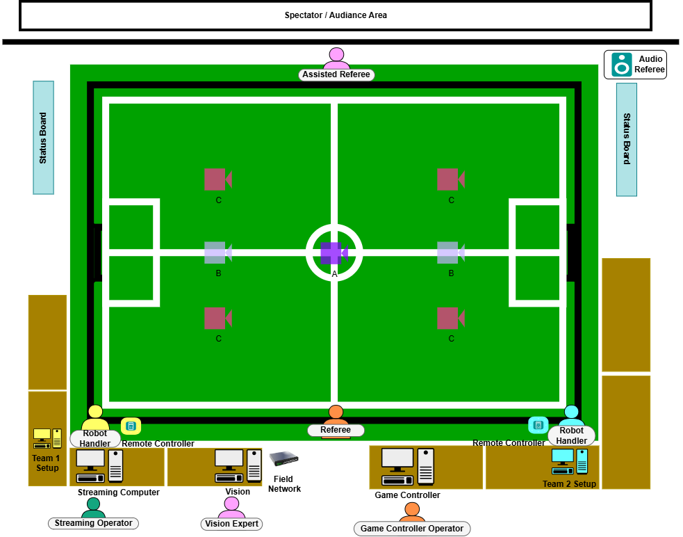
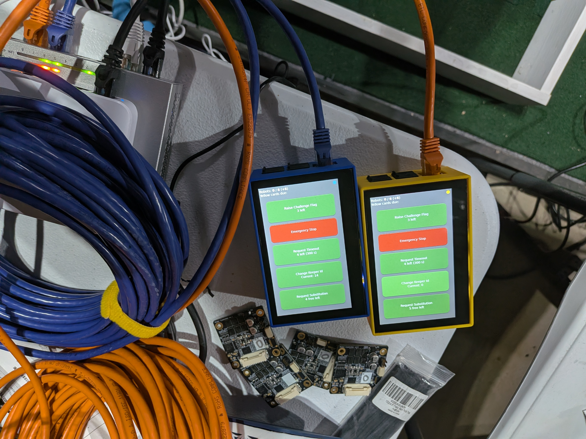
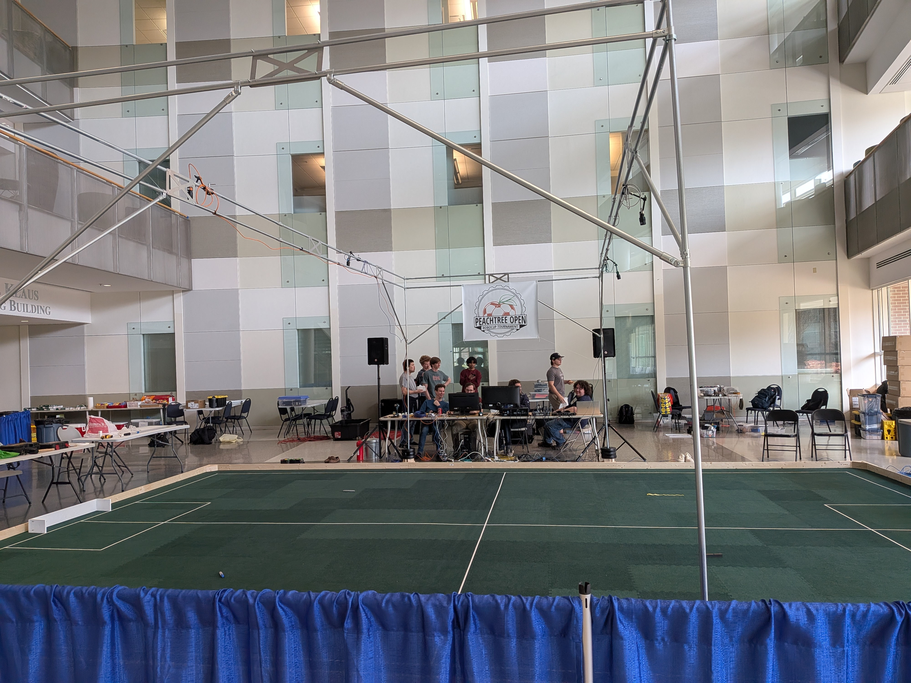

# Competition Field

This page describes a full feature competition field setup and layout.
[Field dimensions](https://robocup-ssl.github.io/ssl-rules/sslrules.html#_dimensions) are described in the SSL Rules.

Aspects of the described field are optional, particularly audience facing items. When something is optional, it is so
noted.

## Top Level Diagram

A full diagram is provided below. Scale is approximately relative to the field, but omitted to allow for local variance.

The colors implies the following meaning:

- Yellow - Yellow Team resource
- Blue - Blue Team resource
- Cyan - Event/league resource
- Orange - Role provided by neutral party
- Pink - Role provided by neurtal party

## Placement and Layout Guidance

The above layout is intentionally crafted to provide a smooth experience for officials, teams, and spectators.

### Field Placement

The field should placed in the venue such that a clear separation between spectators and teams is achieved. There's
should be a team area away from the field, often called "the pits", where mechanical and electrical work is done. Teams
spend most of their time in the pits when not competing in a match or testing during an official testing time slot.
Spectators should be granted a clear view of the competition field, but distanced from the pits. Occasionally robots
malfunction so this separation is key. A physical barrier is recommended between spectators and the field and pits.

### Tables

Tables should be no smaller than ~1m x 2m (3 x 6ft). please refer to [Top Level Diagram](#top-level-diagram) for further position reference. 

Since we might not get the same amount of tables per event, and the position of the fields will be different, the following outlines the tables function and each position relative promximity. 

#### Spaces between Tables and Field

For ease of access into the field for Robot Handlers, and Referees, a one-person's gap must be maintiained between the tables and the field. 

The overall position of tables may be adjusted strategicly. This is done so to ensure a clear line of sight between spectators and audiences to the field at all times.  

As there will be ethernet (networking) cables provided to each table, care should be taken to perform proper cable management to ensure that the cables are secure and far from unwanted attention such as participants or workers stepping or tripping on them. The positioning of cables must be placed out of the audiance and spectators line of sight at all times.

#### Vision and Game Controller Computer Tables

The [Vision Computer](#vision-computer) and [Game Controller Computer](#game-controller-computer) each should occupy half of a table separately and located to the left and right of the mid-field line. 

#### Team Tables

Each team should have at least 1 full table next to the field during their match or registered practice slot.

Each table should be provided with one power outlet and one networking cable. It is the team's responsibility to bring a power extension board or additional netowrking equipment  if they require more than one connection during competition and practices.

>Please note that no permanent dedicated field tables per teams are guaranteed; teams are expected to share these tables between matches and practices. 

##### remote controllers

There are 2 remote controllers during comeptition, one for each team, each will be positioned close to the team setup. The positioning of remote controllers affect the Robot Handler is position during the game. 

Ideally, the position of the remote controllers should allow a direct line of sight for the person standing next to it with the Referee and Game Controller Operator. This is preferred as netowrking issues may arise or controller being faulty, and would be easier for the Robot Handler to report the problem to the Referee. 

Robot handlers are encouraged to check with Referee and Game Controller Operator during the game to voice out their concern if the remote controller feels unresponsive. For example a challenge flag has been raised but there was not stopping of the game.  

### Event Equipment

The [Vision Computer](#vision-computer) and [Game Controller Computer](#game-controller-computer) should be placed close to each other, the midfield line, and the referee. This
has several advantages:

- The Referee and Game Controller Operator(GCO) can communicate easily
- The Vision Expert(VE) and GCO can communicate as necessary
- Networking is centrally located and can be patched more easily
- A physical space buffer is provided between the teams and the midfield, lowering congestion.

It's shown in the diagram as being split across the midfield line, but combining them into one table on a single side is
also common. If this is done, it's preferable to have one empty table on the opposing side, or to omit it to provide the
referee a buffer.

Ideally, at least one status board is positioned such that the audience, referees, and teams have good visibility into
the game state. While most events provide at least one status board, a first time event or casual meetup for scrimamge
may not set up any status boards.

If possible, the Audio Referee (at least the speaker) should be placed on the far side of the field so it speaks only to
the audience, not the field *and* audience. It can speak fairly often and this can be overwhelming to the referee and
assistant referee who may be attempting to communicate both across the field and a language barrier.

## Function of Components

Only the function of components, not people are described here. For the purpose of specific human roles, consult the
rules.

### Field Netowrk

The Field Network is a dedicated network that connects all the devices such as [vision computer](#vision-computer), [Game Controller Computer](#game-controller-computer), [Team Computer](#team-computer), [ssl-status board (optional)](#status-board-recommended-optional), and [streaming computer (Optional)](#streaming-computer-optional). This equipement is usually a managed networking switch, located on the ground near the centre of the field, see [image](#competition-field) for more information. 

This Field Network is responsible for providing essential network services See the [Network and Compute](network/compute.md) for physical network details.

### Cameras

One or more overhead cameras are needed to observe the field and pass video frames to league processing software. These
cameras are typically mounted between 2.5m and 6.5m above the field. At official tournaments, they are typically mounted
around 6.0-6.25m. When cameras are mounted near the top of the range, a small computer is mounted with the camera on the
truss or building features. This is usually to overcome difficulties in transmitting raw camera data long distances.
More information is present in the [Cameras and Lenses](cameras.md) page.

### Vision Computer

The vision computer is responsible for providing robot and ball position data via the network. League software processes camera data and field geometry to produce accurate positions. 

This computer requires a connection to the field cameras directly, or the additional computer that connects to the Field Cameras.

Fields may have different camera combinations. See the [Vision Protocol](/protocol/vision.md) page for the league software that fills this role.

### Game Controller Computer

The Game Controller Computer hosts [ssl-game-controller] that also publishes information to [ssl-status-boards](#status-board-recommended-optional). This software holds crucial information on game state, events, and team informations. 

Similar to [Vision Computer](#vision-computer), the Game Controller Computer communicates the information via the [Field Netowrk](#field-netowrk). 

Due to the properties of [ssl-game-controller]()It also accepts requests from the teams via the remote control or
optionally the team AI software. See the [Referee Protocol](/protocol/referee.md) page for the league software that
fills this role.

### Remote Control

Each team is provided a remote control at the field to interact with the controller/referee software. These are labeled
"RC" in the diagram. Teams use these to request timeouts and robot exchanges. If possible, the 3D printed cases should
be color matched to the team so it's clear which remote is which. Additionally, cables should be color matched as well.
Often times networking contractors at large events are unable to accommodate the remote color matching.

### Team Computer

Teams are responsible for bringing their own computer to run their software and AI. Teams should expect only one network and one power connection at their table. 

Teams are encoraged to bring additional equipment to make their connections, communications to robot, troubleshooting and debuging work.  

### Status Board (Recommended, Optional)

The status board displays the score, game time, and events such as infractions and goals. At least one display should be
available to the referees and teams. Additional displays for the audience are optional.

### Streaming Computer (Optional)

The streaming computer is labeled "SC" on the diagram. It is an optional system to record and stream video in realtime
to one or more livestreams. It is capable of switching between camera feeds and can receive the game state on the field
network to produce a scoring overlay for viewiers. This is the only computer to which an internet connection is
guaranteed to be provided. Because it is optional, some competitions completely omit this system.

### Audio Referee (Optional)

The [audio referee](https://github.com/TIGERs-Mannheim/AudioRef) receives the game state and announces key events to the
audience automatically. Because it is optional, some competitions completely omit this system.

## Possible Configurations

A key challenge with setting up a RoboCup SSL events or lab space is the camera arrangement. Mounting cameras high up
carries strong advantages in producing a low-distoration image with a fewer number of cameras. This is a massive benefit
when setting up many fields at the international event. However, for many lab spaces and lower-cost events mounting
cameras at 6m simply isn't possible (ceiling is too low) or carries significant expense (renting overhead mounts and
certified personnel). As such, camera configuration may vary from event to event, though the main international event is
fiarly consistent. Some common configurations are listed below.

### International Event - Division B

The simplest configuration is the international event Division B field. In this configuration, a single camera is
mounted at ~6.25m in position "A" in the layout diagram. A computer is mounted with it on the overhead truss. The vision
computer remotely accesses the camera computer mounted overhead. In this configuration, the vision computer is only used
for remote access.

### International Event - Division A

The second simplest configuration is the international event Division A field. In this configuration, a two cameras are
mounted at ~6.25m in positions "B" in the layout diagram. Each camera covers half a field. A single camera is not used
because it would need to be nearly quadruple the resolution and mounted even higher, which often practically impossible.
A computer is mounted with each camera on the overhead truss in positions "B". The vision computer remotely accesses the
camera computers mounted overhead, one at a time. In this configuration, the vision computer is only used for remote
access.

### Regional Event

Regional events may cut costs by mounting a higher number of cameras lower to the ground. These cameras can also be
lower resolution because they are covering a smaller area of the field. This configuration is used at the North American
Peachtree Open Event. In this configuration, 4 cameras are mounted at positions "C". Because the data is lower and
mounting is lower, computers are not mounted overhead with the cameras, but instead the raw camera data is sent directly
to the vision computer. In this case, the vision computer is not used for remote access, but directly hosts the software
that processes the vision data.

This picture is taken from the 1st Annual Peachtree Open. Notice there are four overhead cameras, none with associated
computers overhead. The vision and game controller computers are on the back field side, though they are obstructing the
midfield line which is not ideal. Note team tables to the left (and right, not pictured) do not block the spectator
view. Blue pipe and drape separates the spectators from the field. Team pits are located along the back wall.

Not all regional events use this modified configuration. For example the Japan Open and German Open do not, as they have
established infrastructure and event space to do the higher mounting.

### University Lab Space

University lab space also has ceiling height and cost constraints most of the time. A typical lab configuration looks
similar to the regional event configuration, but with only a partial field and even fewer cameras. Often labs have a
half or quarter Division B field, with one or two cameras. Sometimes the cameras are mounted to the side and not
overhead. More details on this configuration can be seen in the [lab layout](lablayout.md) page.
