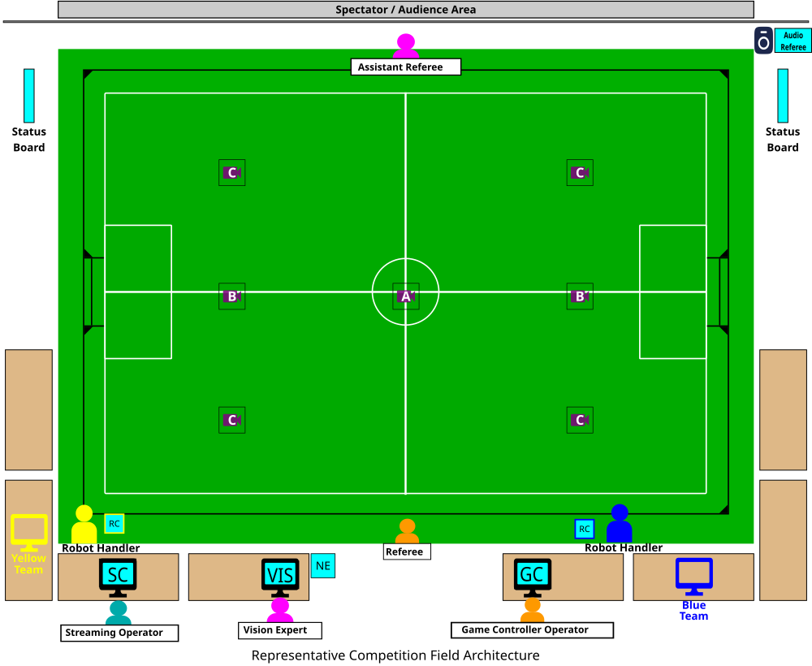

# Competition Network

This page describes the logical and physical network that runs the fields at the international competition. At the
international event, the league typically supports:

- 1 Division A match field
- 1-2 Division B match fields
- 1 Division B practice field

This document will first cover a top level connection diagram, then a physical connection diagram. League protocols that
transmit on the network are covered in a separate page.

If you have not already familiarized yourself with the [competition layout](../complayout.md), please do so first. Also
checkout the [lab network](labnetwork.md) page for a simpler version of the field network that aligns with lab or
regional event single-field deployments.

## High Level Overview

The competition layout is re-posted here for convenience.



### Networking Equipment

Every field needs networking equipment to provide key services:

- Physical connectivity across all field components
- Addresses for computers
- Multicast and broadcast support for distributing league traffic
- Isolation from other networks and fields

A switch at each field provides physical connectivity to all computers at the field via Gigabit Ethernet. These
connections are almost always copper Cat 5e or Cat 6. Switches should only service one field, no cross over.

A router provides the rest of the functionality. The router hosts a
[DHCP](https://en.wikipedia.org/wiki/Dynamic_Host_Configuration_Protocol) server to dynamically allocate addresses to
all machines at the field. It may provide management services for broadcast and multicast as well (e.g. an
[IGMP](https://en.wikipedia.org/wiki/Internet_Group_Management_Protocol) quierier). **Teams at the field should expect
to be able to walk up to an unused cable and receive an IP address.** Teams should expect the addresses of field
computers and their own computer to change overnight or between matches, as DHCP leases may expire.

The router's firewall also typically isolates traffic. It will restrict broadcast and multicast to a specific field. It
may also be used to prohibit connection to the internet if affects the reliability of a field during a match. Any event
that runs multiple fields needs to provide strong partitioning between each field network. Failure to do so results in
conflicting vision and referee data and makes isolating offending services very difficult. There are two ways to do this
with a router, physical isolation and virtual isolation.

The diagrams below show the options.

````{container} two-col-diagram-grid wide-right
**Physical Network Core**

**VLAN Network Core**

```{mermaid} diagrams/net-core.mmd
```

```{mermaid} diagrams/net-core-vlan.mmd
```
````

Left, providing a physical router/firewall per field solves the isolation problem by default. Nearly all routers will
have default rules in place to disallow broadcast and multicast traffic between the WAN (upstream) and LAN ports. This
is the configuration most teams use in their lab, and many regional events use as well. Again, if multiple field
switches are connected via the LAN ports, the isolation is broken.

Right, big event competitions will use a more complex configuration. This is mostly the result of a logistics
complication; big event spaces will have a dedicated networking contractor/company and this company provides the field
networking equipment. It is generally easier for them to provide *virtual isolation* between fields as a part of the
bigger picture that provides networking at the venue to multiple leagues and may utilitze existing infrastructure in the
building. The mechanism that provides this isolation is called a [VLAN](https://en.wikipedia.org/wiki/VLAN). When this
mode of isolation is used, the SSL committees typically have no information or control regarding the backing
configuration. Compatible switches combined with a router can tag traffic to specific VLANs and networking equipment is
configured to prohibit cross-VLAN communication. A reasonable VLAN configuration would be one VLAN per field, though a
networking contractor has never confirmed this for sure at an international event. The router and switches must both
support VLAN features for this system to work. When receiving a quote for services from a big contractor, this option is
expected to be cheaper than having them provide dedicated equipment.

### Cameras

There are two paradigms for camera mounting. In both cases the cameras are mounted on a ceiling or truss. The main
difference is the location of the computer ingesting raw video data. In most competition configs, small computers are
suspended on the truss with the camera. In most lab configs the cameras stand alone on the ceiling (or truss) and the
computer is field side. Putting distributed compute on the truss sounds unnecessairly complex and expensive. Why pay for
multiple computers? Why force remote access to them? The reason is uncompressed video bandwidth. Machine vision cameras
typically don't compress their video. This means means the data link between the camera and vision computer must
reliably transport the full bitrate. Take for example the league camera that have a resolution of 2448 x 2024. This
means an image is 5MP. At 12bit (1.5 byte) color depth, and 75 fps. The data rate is 4.45 gbit/s excluding medium
[line code](https://en.wikipedia.org/wiki/Line_code) and
[error correction code](https://en.wikipedia.org/wiki/Error_correction_code) which add additional overhead. As of 2026,
carrying multiple 5gbit/s signals more than a few meters is still an expensive proposition. It was even more so when the
cameras were purchased in ~2019. 10GbE networking equipment is hundreds to thousands of dollars, and 5 and 10GbE machine
vision cameras are relatively new. USB 3.1+ cable extenders are also many hundreds of dollars per extender. This means
the cost to buy a small truss computer is about the same as methods to extend high-bitrate signals to the ground
reliably. As such, at the time of purchasing the league equipment, the committees concluded the on truss computer was a
more reliable option. The league purchased [NUCs](https://en.wikipedia.org/wiki/Next_Unit_of_Computing).

For most lab setups, the length of USB cable needed is short enough, that a USB 3.1+ extender is not needed, just a nice
cable. Alternatively, the small field size means 1Gbit PoE is enough to carry the raw video frames, and expensive
networking equipment is not needed. As such, competitions run distributed vision systems, with primary processing being
on the truss and the field vision computer just providing a human interface for remote access. Most lab configurations
have the field side computer run everything, but the cable length and bitrates involved support this simpler cheaper
configuration.

Strictly talking about competition configs, the on truss mounting is used for Division A and Division B fields at the
international event. Those configurations run 2-camera, 2-NUC and 1-camera, 1-NUC config respectively. Regional events
may use the 4-camera direct config for a Division B field if a sufficiently high truss cannot be secured. Limits on
optics and distortion force more cameras at lower resolution when truss height is low.

These options are shows in the table below.

````{container} two-col-diagram-grid
**Truss NUC — 1–2 Cameras**

**Direct Wiring — 4 Cameras**

```{mermaid} diagrams/cam-nuc.mmd
```

```{mermaid} diagrams/cam-direct.mmd
```
````

### Field Side

The networking of the remaining computers field side is straightforward. At this point, the complex requirements of
isolation and high bitrates are handled. The rest of the system is latency sensitive, but the data rate is so low this
is virtually never a problem when using wired connectivity. All equipment is linked via GbE copper to the field-side
switch. The remote controls need [Power over Ethernet (PoE)](https://en.wikipedia.org/wiki/Power_over_Ethernet) for
power.

```{mermaid} diagrams/field-side-equipment.mmd
```

## Detailed Diagram

The below diagrams show near full instantiations of above general architecture. As noted in the legend of the diagrams,
some items like IP addresses and VLANs are examples. In reality IP addresses will be dynamically allocated and will
change throughout the competition. Other such information is noted in the legend box.

### Truss NUC Config — Division A / Division B

```{image} diagrams/ssl_field_network_fanout_truss.light.svg
---
class: only-light
alt: SSL field network fan-out diagram, truss-mounted camera config
---
```

```{image} diagrams/ssl_field_network_fanout_truss.dark.svg
---
class: only-dark
alt: SSL field network fan-out diagram, truss-mounted camera config
---
```

### Direct Wiring Config — Regional Division B

```{image} diagrams/ssl_field_network_fanout_direct.light.svg
---
class: only-light
alt: SSL field network fan-out diagram, direct-wired camera config
---
```

```{image} diagrams/ssl_field_network_fanout_direct.dark.svg
---
class: only-dark
alt: SSL field network fan-out diagram, direct-wired camera config
---
```

## Technical Configurations

This section contains technical configurations for the network and computers that aren't captured by the physical and
logical layouts above.

### Hostnames

The hostname convention for machines is `<owner/event>-<role>-<id>`. Examples are included below.

- truss NUCs: `ssl-vision-a`, `ssl-vision-b` etc.
- field vision computer: `ssl-vision-b0` where "b0" is the field name
- field game controller computer: `ssl-gc-b0` where "b0" is the field name

Host names may also reflect the machine owner or event name `pto-vision` where "pto" refers to the Peachtree Open.

### LAN Config

Field LAN should always be [IPv4](https://en.wikipedia.org/wiki/IPv4) and never
[IPv6](https://en.wikipedia.org/wiki/IPv6), though the upstream WAN/venue network may be IPv6. Field LAN should supply
at least a /24 subnet, with /16 preferred. For an example network, 10.10.0.0/16:

- Subnet address CIDR notation: `10.10.0.0/16`
- Gateway: 10.10.0.1
- Reserved for management addressing: `10.10.0.2`-`10.10.0.5`
- DHCP range: `10.10.0.6`-`10.10.255.249`
- Broadcast address: `10.10.255.255`

[CIDR standardized notation and allocations](https://en.wikipedia.org/wiki/Classless_Inter-Domain_Routing)

### IGMP Querier and IGMP Snooping Settings

Somebody knowledgeable needs to root cause, data cap, and show mitigation settings. Look at Incheon stuff...

## Additional Resources

- [Network Router](<https://en.wikipedia.org/wiki/Router_(computing)>)
- [Network Switch](https://en.wikipedia.org/wiki/Network_switch)
- [IPv4](https://en.wikipedia.org/wiki/IPv4)
- [Classless Inter-Domain Routing](https://en.wikipedia.org/wiki/Classless_Inter-Domain_Routing)
- [List of Reserved IP Addresses](https://en.wikipedia.org/wiki/List_of_reserved_IP_addresses)
- [Power over Ethernet](https://en.wikipedia.org/wiki/Power_over_Ethernet)
