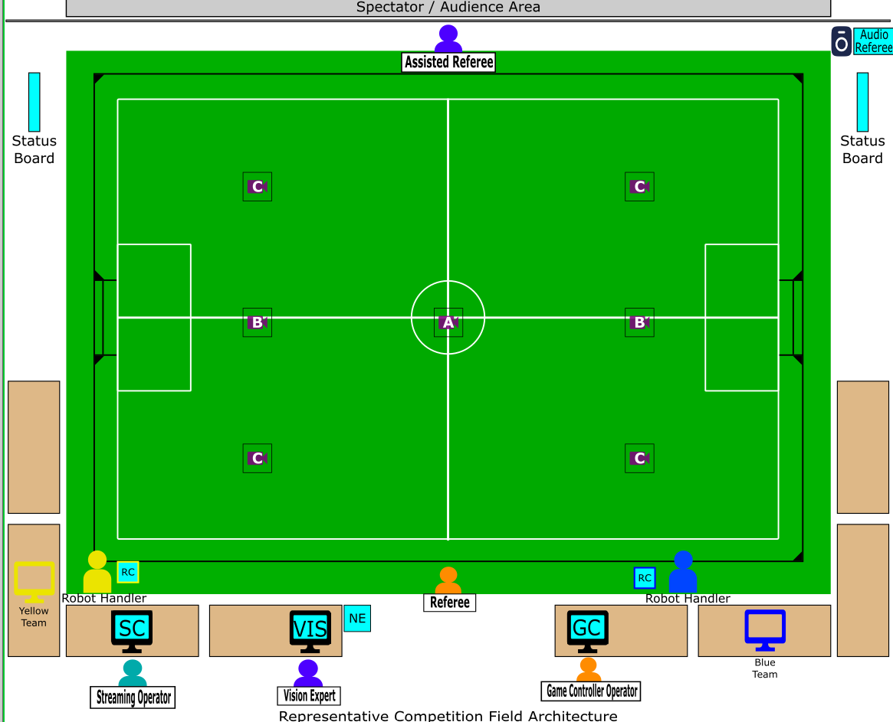
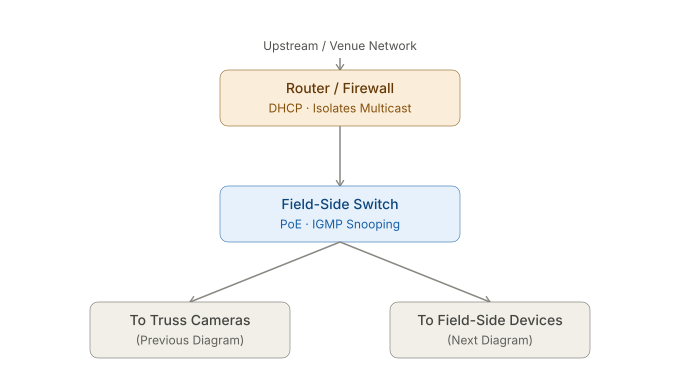
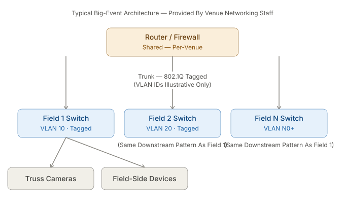

# Competition Network

This page describes the logical and physical network that runs the fields at the international competition. At the
international event, the league typically supports:

- 1 Division A match field
- 1-2 Division B match fields
- 1 Division B practice field

This document will first cover a top level connection diagram, then a physical connection diagram. League protocols that
transmit on the network are covered in a separate page.

If you have not already familiarized yourself with the [competition layout](../complayout.md), please do so first. Also
checkout the [lab network](labnetwork.md) page for a simpler version of the field network that aligns with lab or
regional event single-field deployments.

## High Level Overview

The competition layout is re-posted here for convenience.



### Networking Equipment

Every field needs networking equipment to provide key services:

- Physical connectivity across all field components
- Addresses for computers
- Multicast and broadcast support for distributing league traffic
- Isolation from other networks and fields

A switch at each field provides physical connectivity to all computers at the field via Gigabit Ethernet. These 
connections are almost always copper Cat 5e or Cat 6. Switches should only service one field, no cross over.

A router provides the rest of the functionality. The router hosts a
[DHCP](https://en.wikipedia.org/wiki/Dynamic_Host_Configuration_Protocol) server to dynamically allocate addresses to
all machines at the field. It may provide management services for broadcast and multicast as well (e.g. an
[IGMP](https://en.wikipedia.org/wiki/Internet_Group_Management_Protocol) quierier). **Teams at the field should expect
to be able to walk up to an unused cable and receive an IP address.** Teams should expect the addresses of field
computers and their own computer to change overnight or between matches, as DHCP leases may expire.

The router's firewall also typically isolates traffic. It will restrict broadcast and multicast to a specific field. It
may also be used to prohibit connection to the internet if affects the reliability of a field during a match. Any event
that runs multiple fields needs to provide strong partitioning between each field network. Failure to do so results in
conflicting vision and referee data and makes isolating offending services very difficult. There are two ways to do this
with a router, physical isolation and virtual isolation.

The diagrams below show the options.

```{container} full-width-table
| Physical Network Core                                             | VLAN Network Core                                               |
| ----------------------------------------------------------------- | --------------------------------------------------------------- |
|  |  |
```

Left, providing a physical router/firewall per field solves the isolation problem by default. Nearly all routers will
have default rules in place to disallow broadcast and multicast traffic between the WAN (upstream) and LAN ports. This
is the configuration most teams use in their lab, and many regional events use as well. Again, if multiple field
switchs are connected via the LAN ports, the isolation is broken.

Right, big event competitions will use a more complex configuration. This is mostly the result of a logistics 
complication; big event spaces will have a dedicated networking contractor/company and this company provides the field
networking equipment. It is generally easier for them to provide *virtual isolation* between fields as a part of the
bigger picture that provides networking at the venue to multiple leagues and may utilitze existing infrastructure in the
building. The mechanism that provides this isolation is called a [VLAN](https://en.wikipedia.org/wiki/VLAN). When this
mode of isolation is used, the SSL committees typically have no information or control regarding the backing
configuration. Compatible switches combined with a router can tag traffic to specific VLANs and networking equipment
is configured to prohibit cross-VLAN communication. A reasonable VLAN configuration would be one VLAN per field, though
a networking contractor has never confirmed this for sure at an international event. The router and switches must both
support VLAN features for this system to work. When receiving a quote for services from a big contractor, this option
is expected to be cheaper than having them provide dedicated equipment.

### Cameras

### Field Side